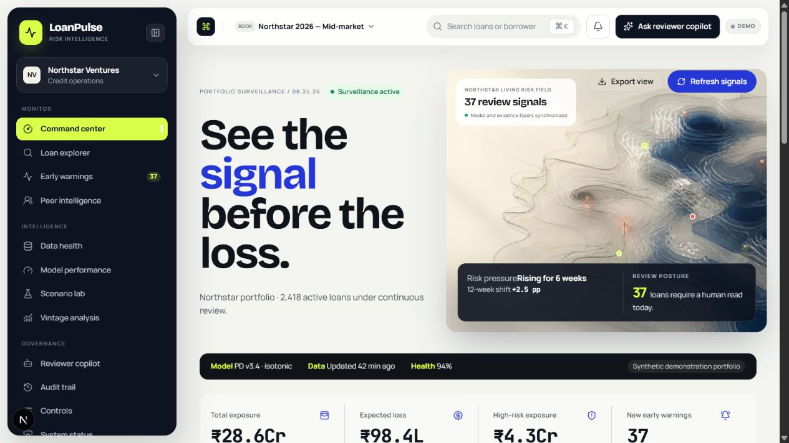
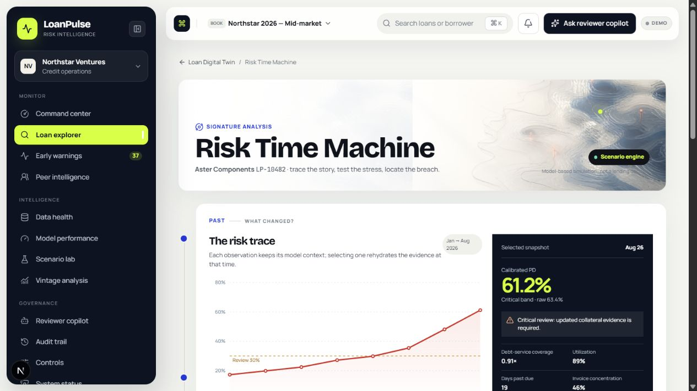
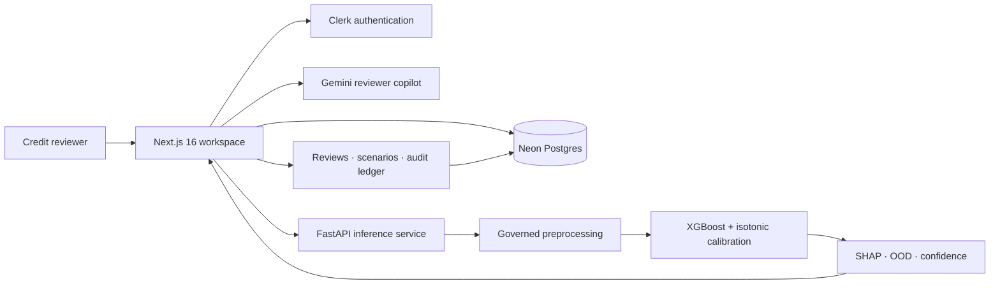

<div align="center">
  
  <h1>LoanPulse AI</h1>
  <p><strong>Evidence-led loan surveillance for teams that need to see risk moving—not just where it landed.</strong></p>
  <p>
    
    
    
    
    
    
  </p>
</div>



LoanPulse is a full-stack institutional credit-risk workspace. It combines a high-density portfolio command center, loan-level digital twins, reviewer governance, and a reproducible calibrated machine-learning service. The interface uses Indian currency conventions and keeps model evidence beside every reviewer decision.

> **Decision-support boundary:** the included model and portfolio are a public-data demonstration. They are not approved for autonomous lending decisions or direct use on an Indian lending population.

## Signature workflow — Risk Time Machine



One connected analysis explains a loan in under a minute:

- **Past:** select any observation and recover its feature snapshot, calibrated PD, SHAP movement drivers, warning state, and anomaly percentile.
- **Present:** see calibrated and raw PD, velocity, acceleration, expected loss, confidence, and model disagreement together.
- **Future:** stress eligible borrower inputs and compare observed versus scenario risk after a debounced inference request.
- **Breaking point:** numerically search governed ranges for the smallest one-variable change that breaches a selected threshold.

## What is implemented

| Layer | Capability |
| --- | --- |
| Portfolio operations | Command center, sortable loan explorer, early warnings, peer intelligence, vintage analysis, scenario lab |
| Loan intelligence | Digital twin, risk trajectory, feature evidence, calibrated probability, SHAP drivers, OOD and disagreement signals |
| Human governance | Persistent reviews, reviewer copilot, audit trail, access controls, confidence-based decision withholding |
| Data platform | Neon-compatible PostgreSQL schema, migrations, seed workflow, validated ingestion endpoint, repository fallback for demo mode |
| ML engine | Automated schema analysis, profiling, leakage checks, modular feature transforms, chronological splitting, calibration, SHAP, OOD, artifact persistence |
| Operations | Health/readiness endpoints, structured logs, Docker images, local Compose, Render Blueprint, Vercel configuration |

## Architecture



The frontend can run safely in `demo` mode without external services. In `production` mode, readiness fails closed when required credentials or the database are unavailable.

## Public benchmark model

The included candidate was trained from Kaggle's **All Lending Club loan data** (`wordsforthewise/lending-club`, CC0). Raw data is never committed. A deterministic sample preserves the complete time range and mature terminal outcomes.

| Property | Result |
| --- | ---: |
| Prepared observations | 449,080 |
| Default / charged-off rate | 19.96% |
| Train period | Jun 2007 – Apr 2014 |
| Validation period | May 2014 – Aug 2016 |
| Test period | Sep 2016 – Dec 2018 |
| Primary model | XGBoost |
| Selected calibration | Isotonic |
| Test ROC AUC | 0.6973 |
| Test PR AUC | 0.3710 |
| Test Brier score | 0.1579 |
| Test expected calibration error | 0.0194 |

The strict chronological split is never shuffled. Training only admits application/origination-time fields through two allow-lists; post-outcome payments, recoveries, settlements, hardship events, and unresolved loan outcomes are excluded. See [dataset governance](docs/datasets/lending-club.md) and the [artifact deployment card](artifacts/production/DEPLOYMENT.md).

## Quick start

### Web application

```powershell
npm install
Copy-Item .env.example .env.local
npm run dev
```

Open `http://localhost:3000`. The default demo mode uses realistic, clearly labelled synthetic portfolio data.

### ML service

```powershell
python -m venv .venv
.\.venv\Scripts\python.exe -m pip install -e ".[test]"
$env:MODEL_ARTIFACT_PATH="artifacts/production"
$env:ML_SERVICE_API_KEY="replace-with-a-long-random-secret"
.\.venv\Scripts\loanpulse-serve.exe
```

The API exposes `/health`, authenticated `/ready`, and authenticated `/v1/predict` endpoints. A pre-trained production-candidate artifact is included so Render can serve inference without retraining during deploy.

### Reproduce training

```powershell
python -m kaggle datasets download wordsforthewise/lending-club `
  -f accepted_2007_to_2018Q4.csv.gz `
  -p data/raw

.\.venv\Scripts\python.exe scripts\prepare_lending_club.py
.\.venv\Scripts\loanpulse-ml.exe train `
  --input data\processed\lending_club_train.csv.gz `
  --config config\lending-club.yaml `
  --artifacts artifacts
```

Use `--sample-modulus 1` in the preparation step to retain all mature outcomes when enough memory and training time are available.

## Environment setup

Copy `.env.example` to `.env.local`; never commit the populated file.

| Variable | Purpose | Required in demo |
| --- | --- | --- |
| `DATABASE_URL` | Neon pooled runtime connection | No |
| `DATABASE_URL_UNPOOLED` | Direct migration connection | No |
| `NEXT_PUBLIC_CLERK_PUBLISHABLE_KEY` / `CLERK_SECRET_KEY` | Authentication | No |
| `GEMINI_API_KEY` | Reviewer copilot responses | No |
| `ML_SERVICE_URL` / `ML_SERVICE_API_KEY` | Remote inference | No |
| `INGESTION_API_KEY` | Portfolio ingestion protection | No |
| `CRON_SECRET` | Operational endpoint protection | No |

When production credentials are present:

```powershell
npm run db:setup
npm run build
```

The [production runbook](docs/production-runbook.md) covers Neon, Clerk, Gemini, the inference service, smoke tests, and rollback checks.

## Quality gates

```powershell
npm run lint
npm run typecheck
npm test
.\.venv\Scripts\python.exe -m pytest
npm run build
```

The test suite covers feature ordering, nulls, unseen categories, extreme values, date leakage, single and batch inference, risk logic, and the Lending Club adapter. Browser verification additionally exercises the application shell, navigation, portfolio table, and Risk Time Machine interactions.

## Repository map

```text
app/                  Next.js routes, pages, and server endpoints
components/           Institutional UI and interactive analysis modules
lib/server/           Auth, config, database, repository, ML client, validation
db/migrations/        Neon/PostgreSQL production schema
ml/src/loanpulse_ml/  Training, inference, explainability, calibration, OOD
scripts/              Dataset preparation, migrations, and seed workflows
artifacts/production/ Versioned deployable model candidate
docs/                 Research, governance, runbooks, and implementation plan
```

## Known limitations

- The benchmark is historical US peer-to-peer lending data; population transfer to Indian borrowers is not defensible without representative retraining and validation.
- The current 0.50 classification threshold favors precision and has low recall; operating thresholds must be selected against policy costs and capacity.
- Fairness assessment, adverse-action reason governance, external feature contracts, drift alerts, and challenger promotion approval remain required before regulated use.
- Demo scenario movements are transparent approximations when the remote ML service is not configured.

---

<div align="center">
  Built as a governed decision-support system: calibrated probabilities, visible evidence, and a human accountable for the outcome.
</div>
